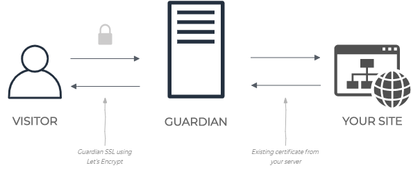

# Guardian Web Application Firewall

Guardian is the open source web application firewall based on ModSecurity SecRule format.

# How it works!
Guardian locates in front of your web server and if incoming traffic valid then the Guardian passes it to the target server.

## Guardian Nameserver
[Guardian Nameserver](https://github.com/asalih/guardian_ns) To route web traffic through the Guardian, update the nameservers at your domain registrar to resolve your domain’s DNS with Guardian's nameservers.

## Guardian Dashboard
[Guardian Dashboard](https://github.com/asalih/GuardianUI) To managing your rules and domains.

## Docker
There is [docker-compose.yml](docker-compose.yml) available. Builds the following apps using Dockerfiles.
-   db
    - Runs postgres image with default settings and guardiandb created in it.
-   guardian
    - Runs golang image then builds the waf from master branch. Listens 80 and 443 ports.
-   guardian_dashboard
    - Runs mcr.microsoft.com/dotnet/core/sdk:3.0 image then builds the dashboard app from master branch. Listens 8080 port.

## TODO
-   General improvements & better testing
-   Usecase